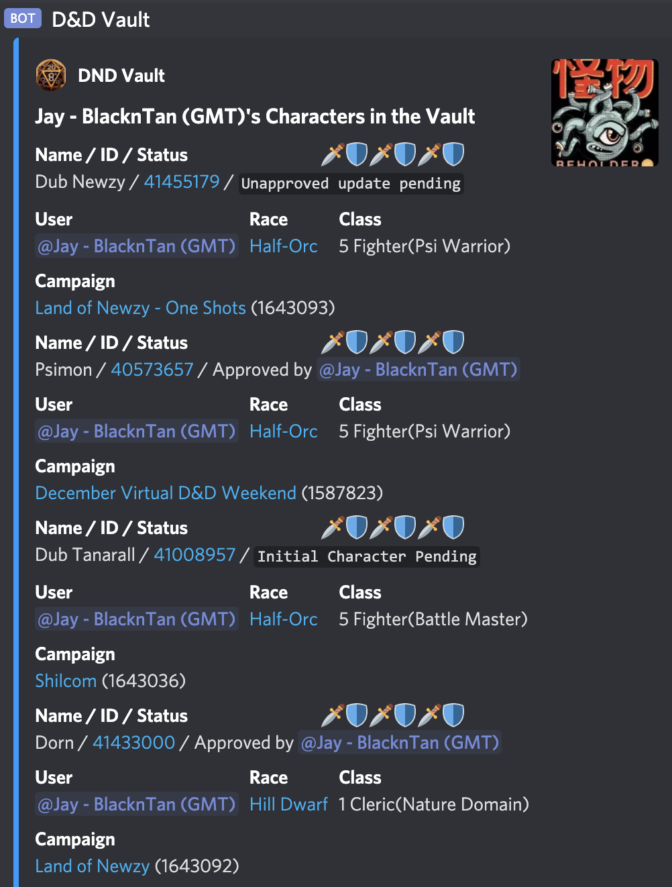
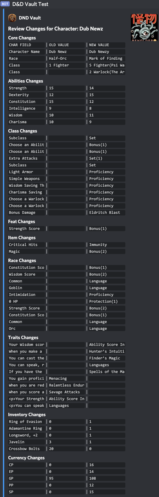
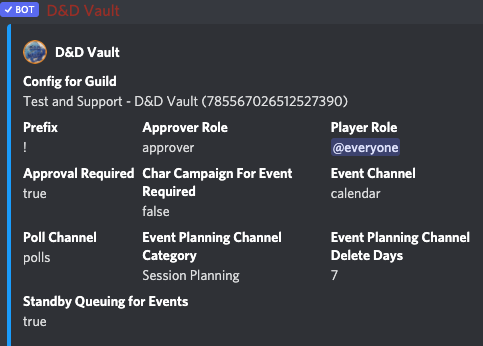

<!-- START doctoc generated TOC please keep comment here to allow auto update -->
<!-- DON'T EDIT THIS SECTION, INSTEAD RE-RUN doctoc TO UPDATE -->
**Table of Contents**  *generated with [DocToc](https://github.com/thlorenz/doctoc)*

- [DND Vault Discord BOT](#dnd-vault-discord-bot)
  - [Commands](#commands)
  - [Screenshots](#screenshots)
    - [list](#list)
    - [changes](#changes)
    - [config](#config)
  - [Notes](#notes)
    - [Mongodb queries](#mongodb-queries)

<!-- END doctoc generated TOC please keep comment here to allow auto update -->

# DND Vault Discord BOT

This "vault bot" enables a party to enable an approval concept of Dungeons and Dragons characters from dndbeyond.com and the changes they make to them.  This allows a (multiple) DMs to ensure that the character changes that a user makes on dndbeyond are accurate for their campaigns.

Invite the bot using --> https://discord.com/api/oauth2/authorize?client_id=792843392664993833&permissions=92224&scope=bot

Workflow would work something like this.

* Discord users join a server and decide to have a campaign.
* Server owner invites BOT
* Each user creates a character for campaign on dndbeyond.com
* Each user 'registers' character with BOT
* DM 'approves' each character
* Mission occurs
* Users update characters on dndbeyond.com
* Users request 'update' of character with BOT
* DM 'lists queued' character approvals
* DM reviews 'changes' of character
* DM 'approves' character changes

all the while anyone on the server can 'view' any user's character ...

## Example usage

```
!register https://www.dndbeyond.com/profile/BlacknTan/characters/41867999
!list queued
!approve 41867999
!update https://www.dndbeyond.com/profile/BlacknTan/characters/41867999
!list queued
!approve 41867999
```
## Commands

Not all commands are implemented, this is a list of commands that will **hopefully** be implemented in short order. IGNORE the brackets in the usage help below.

- [x] help
- [x] register [DNDBEYOND_URL] - register a character in the vault from dndbeyond
- [ ] list
  - [x] {no args} - list YOUR registered characters within vault
  - [x] all - list all
  - [ ] approved - list all approved
  - [x] queued - list all characters queued for approval
  - [x] user [@USER_NAME] - list all characters by discord user
- [ ] show [CHAR_ID] - show a user's character from the vault
- [x] update [DNDBEYOND_URL] - request an update a character from dndbeyond to the vault
- [x] remove [DNDBEYOND_URL] - remove a character from the vault
- [x] approve [CHAR_ID] - approve a new/updated character within vault
- [x] changes [CHAR_ID] - display changes for an unapproved character update
- [x] config - show BOT config
  - [x] {no args} - show config
  - [x] arole [NEW_ROLE] - modify approver role (allows user to approve characters)
  - [x] prole [NEW_ROLE] - modify player role (allows user to use bot)
  - [x] prefix [NEW_PREFIX] - modify the command prefix

## Screenshots

### list



### changes



### config


## Notes

### Mongodb queries

{id: { $regex: /785567026512527390/i }}
