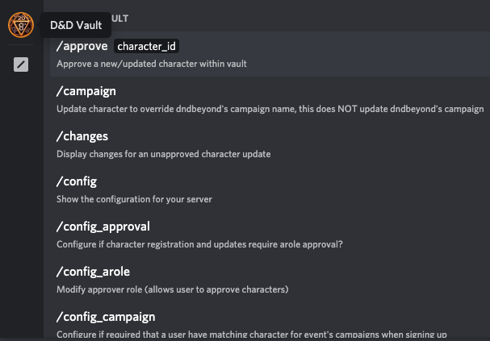
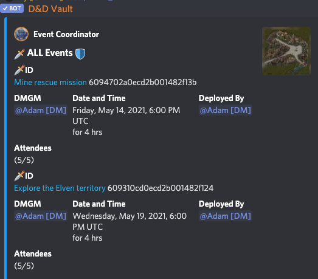
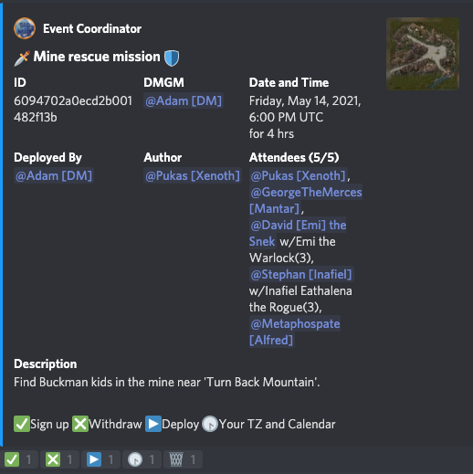
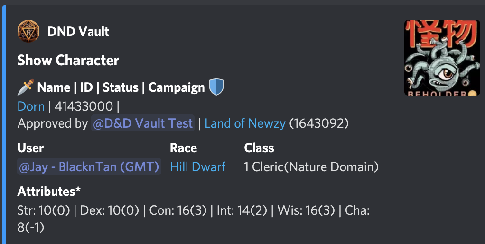
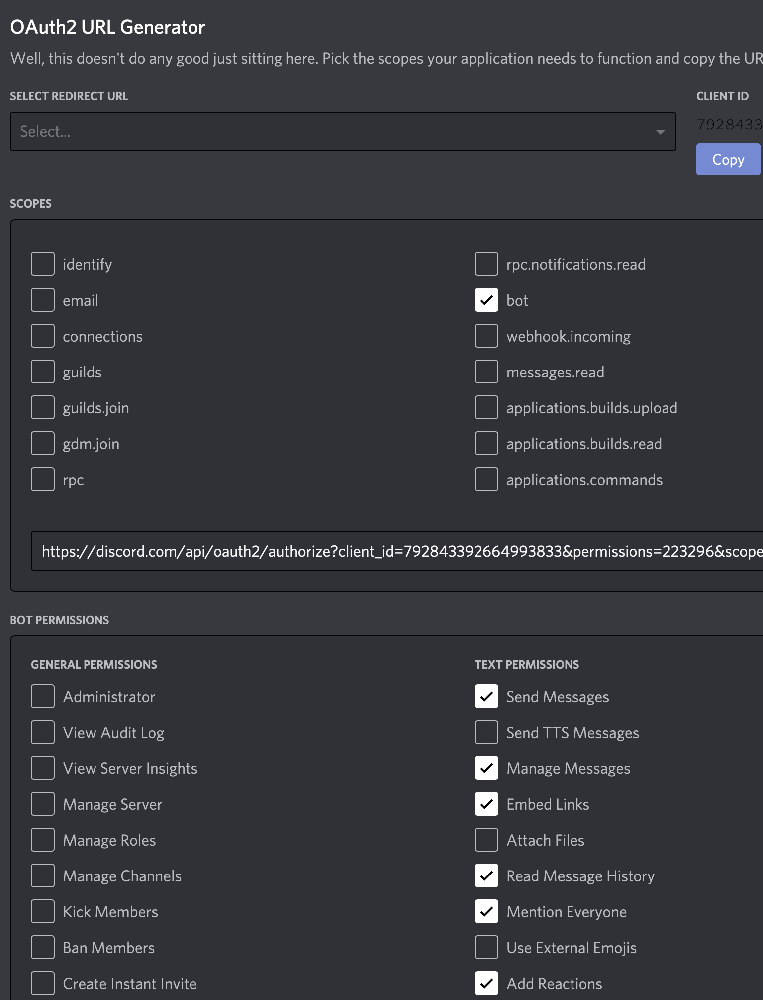

<!-- START doctoc generated TOC please keep comment here to allow auto update -->
<!-- DON'T EDIT THIS SECTION, INSTEAD RE-RUN doctoc TO UPDATE -->
DND Vault Table of Contents

- [D&D Vault Discord BOT](#dd-vault-discord-bot)
  - [Current build status](#current-build-status)
  - [Character Vault](#character-vault)
  - [Events](#events)
    - [Subscribe to the iCalendar ICS](#subscribe-to-the-icalendar-ics)
  - [Polling](#polling)
  - [Rolling dice](#rolling-dice)
    - [Die quantity](#die-quantity)
    - [Example usages](#example-usages)
  - [Feedback and Support Discord](#feedback-and-support-discord)
  - [Invite the BOT to your server](#invite-the-bot-to-your-server)
  - [Commands](#commands)
    - [Functionality Documentation](#functionality-documentation)
    - [Slash Commands](#slash-commands)
    - [Slash Command Descriptions](#slash-command-descriptions)
    - [Old Command Descriptions](#old-command-descriptions)
  - [Example character workflow with the BOT](#example-character-workflow-with-the-bot)
  - [Example character workflow usage with approvals 'true'](#example-character-workflow-usage-with-approvals-true)
  - [Screenshots](#screenshots)
    - [event list](#event-list)
    - [event](#event)
    - [poll](#poll)
    - [show character](#show-character)
    - [list characters](#list-characters)
    - [changes in character updates](#changes-in-character-updates)
    - [config of server for guild](#config-of-server-for-guild)
  - [Run the bot yourself](#run-the-bot-yourself)
    - [Permissions required for bot](#permissions-required-for-bot)
  - [Developer contributions](#developer-contributions)
    - [pre-commit](#pre-commit)
    - [run nodemon](#run-nodemon)
  - [Notes](#notes)
    - [create change log for release](#create-change-log-for-release)
    - [Test via docker container](#test-via-docker-container)
    - [Mongodb queries](#mongodb-queries)
    - [Bot Commands for testing](#bot-commands-for-testing)
    - [Test Bot Invite](#test-bot-invite)

<!-- END doctoc generated TOC please keep comment here to allow auto update -->

# D&D Vault Discord BOT

The most complete Dungeons and Dragons ( DnD ) Event Management, Character Vault, Polling and Dice Roller for your West Marches discord server!

## Current build status

- [Change Log](CHANGELOG.md)

- Develop Branch - Development Tests
  - [](https://github.com/pre-commit/pre-commit)
  - [](https://github.com/jcolson/dndvault-bot/actions/workflows/test.yaml)

- Docker Branch - Releases
  - [](https://github.com/jcolson/dndvault-bot/actions/workflows/dockerhub.yml)

## Character Vault

This "vault bot" enables a party to enable an approval concept of Dungeons and Dragons characters from [DND Beyond](https://dndbeyond.com/my-characters) (or 'stub' characters not on dndbeyond using the `!register manual` command) and the changes they make to them via [Discord](https://discordapp.com).  This allows a (or multiple) DMs to ensure that the character changes that a user makes on [DND Beyond](https://dndbeyond.com/my-characters) are accurate for their campaigns.

The primary driver for this functionality was watching so many DM/GMs trying to manage [West Marches](http://arsludi.lamemage.com/index.php/78/grand-experiments-west-marches/) type Discord servers using spreadsheets/etc.  The bot works great for "non" West Marches type campaigns as well!  This can make things a bit easier to maintain for online Dungeons and Dragons players and DMs.

Approval functionality is configured 'false' by default, enable it by running `!config approval true`.

## Events

The bot also offers the ability to schedule events (missions) and allow attendees (party members) to sign up for attendance, or remove themselves from attendance.  The bot will also convert the default time (GMT) to the user's local timezone upon request via the clock reaction on the event.  Events can be 'deployed' to show that they are 'approved' and have all the proper components (DM/GM, attendees, etc).

Event campaign enforcement is configured off ('false') by default.  Turning it on ensures that the players that sign up for an event have a 'character' in the vault that is also related to the event's campaign (if set) via `!campaign` or a dndbeyond's campaign).  Turn this on by issuing `!config campaign true`

Users have the ability to list events that are deployed or proposed (not yet approved/deployed).

### Subscribe to the iCalendar ICS

Once a user signs up as an attendee, or creates an event, those events will show up in that user's iCalendar ICS feed.  The user can subscribe to the iCalendar ICS feed within Outlook, Google Calendar, iCal, etc.  When a user clicks on the 'Timezone' button, a message is sent to them with their local timezone as well as a link to their personalized iCalendar ICS link.

[](https://www.youtube.com/watch?v=CEnUVG9wGwQ)

## Polling

Users can create polls very simply by using the `poll` command.  `!poll "Do you like polling"` will create a default poll that has three options:  👍 (yes) 👎 (no) and 🤷 (I don't know).  A user can also create his own options, which will be automatically numbered by using this syntax: `!poll "Do you like polling" "hell no" "I LOVE polling" "What is polling?"`.

## Rolling dice

Users can roll dice by using the `roll` command.  The dice roller uses [notation](https://greenimp.github.io/rpg-dice-roller/guide/notation/).

### Die quantity

- A single die has a minimum quantity of 1, and a maximum quantity of 999.
- These are valid: d8, 1d10, 999d6, 20d4 + 999d10
- These are not: 0d10, 1000d6, -1d20

### Example usages

```diff
roll 2 20 sided dice
!roll 2d20

roll 8 20 sided dice and drop the lowest 1
!roll 8d20dl1

values less than 3 are treated as 3
!roll 4d6min3

values greater than 3 are treated as 3
!roll 4d6max3

reroll dice if a 1 is rolled
!roll 1d6r

reroll dice if one is less than 3
!roll 1d6r<3

roll 4 100 sided dice
!roll 4d100

above is the same as rolling percentile dice
!roll 4d%

roll 4 fudge dice
!roll 4dF

```

## Feedback and Support Discord

I'm looking for feedback, so please feel free to open bugs, feature requests, etc.  As well as hop on my discord for direct conversation.  [Join me on this discord for support](https://discord.gg/ueCkbQgxrF)

## Invite the BOT to your server

[Invite the bot to your server](https://discord.com/api/oauth2/authorize?client_id=792843392664993833&permissions=268659792&scope=bot%20applications.commands)

## Commands

### Functionality Documentation

- [Character Vault](#character-vault)
- [Events](#events)
- [Polling](#polling)
- [Rolling dice](#rolling-dice)

All the below commands have been implemented as **slash** (ex: `/register_manual`) commands, and are recommended to be used over the 'old style' prefix (ex: `!register manual`) commands.

All commands that are implemented have a `[x]` next to them.  This is a list of commands that are already implemented as well as commands that are planned.

The brackets below (such as in `register manual [CHARACTER_NAME] [CHARACTER_CLASS] [CHARACTER_LEVEL] [CHARACTER_RACE] {CAMPAIGN}`) are to show you 'placeholders' for arguments that needs to be passed to the command.  `[]` brackets mean that arguments are **required** and `{}` brackets mean that the content is **optional**.

**Roll initiative!**

### Slash Commands

In order to see the new slash commands and their accompanying options and descriptions, just start a slash command by typing `/` and click on `D&D Vault` and you'll see a list of all the available commands.



### Slash Command Descriptions

```fix
- /help
- /register_manual [CHARACTER_NAME] [CHARACTER_CLASS] [CHARACTER_LEVEL] [CHARACTER_RACE] {CAMPAIGN} - create a stub character, do not use spaces in any of the parameters except the campaign
- /register [DNDBEYOND_URL] - register a character in the vault from dndbeyond
- /update_manual [CHAR_ID] [CHARACTER_NAME] [CHARACTER_CLASS] [CHARACTER_LEVEL] [CHARACTER_RACE] {CAMPAIGN} - update a stub character, do not use spaces in any of the parameters except the campaign
- /update [DNDBEYOND_URL] - request an update a character from dndbeyond to the vault
- /remove [CHAR_ID] {@USER_NAME} - remove a character (or pending update) from the vault, if username is passed, remove for that user
- /approve [CHAR_ID] - approve a new/updated character within vault
- /changes [CHAR_ID] - display changes for an unapproved character update
- /campaign [CHAR_ID] [CAMPAIGN_ID] - update character to override dndbeyond's campaign name, this does NOT update dndbeyond's campaign
- /default - show current default character
- /default [CHAR_ID] - set your default character id to be used for events/missions with no campaign
- /list - list YOUR registered characters within vault
- /list_all - list all characters
- /list_queued - list all characters queued for approval
- /list_user [@USER_NAME] - list all characters by discord user
- /list_campaign [CAMPAIGN_ID] - list all characters registered for a campaign
- /show [CHAR_ID] - show a user's character from the vault
- /timezone - view your timezone
- /timezone [TIMEZONE] - set your timezone (required for interacting with events)
- /poll ["Poll Question"] {"Response 0"} {"Response 1"} {"Response 2"} {"Response 3"} ...
- /roll {notation} - rolls dice, using notation reference available here https://greenimp.github.io/rpg-dice-roller/guide/notation/
- /roll_stats - roll for D&D 5E stat block
- /insult - generates a random insult for Vicious Mockery
- /event_attendance - produces a report of players signup attendance for events
- /event_create [MISSION_TITLE] [@DMGM_USER_NAME] [AT_TIME] [FOR_DURATION_HOURS] [ON_DATE] [WITH_NUMBER_PLAYER_SLOTS] {[CAMPAIGN]} [MISSION_DESCRIPTION] - creates an event PROPOSAL that users can sign up for
- /event_edit [MISSION_ID] [MISSION_TITLE] [@DMGM_USER_NAME] [AT_TIME] [FOR_DURATION_HOURS] [ON_DATE] [WITH_NUMBER_PLAYER_SLOTS] {[CAMPAIGN]} [MISSION_DESCRIPTION] - edits an existing event PROPOSAL that users can sign up for - everything is optional for a partial edit
- /event_show [MISSION_ID] - replace the posting for an event (for instance if it got deleted by accident)
- /event_remove [MISSION_ID] - removes mission event
- /event_list - list all future events (and events from the past few days) (PROPOSed and DEPLOYed)
- /event_list proposed - list all future PROPOSED events
- /event_list deployed - list all future DEPLOYED events
- /config [RESET_BOOLEAN] [@PLAYER_ROLE] [@APPROVER_ROLE] [#POLL_CHANNEL] [#EVENT_CHANNEL] [EVENT_STANDBY_BOOLEAN] [EVENT_PLANNING_CHANNEL_CATEGORY] [EVENT_PLANNING_CHANNEL_DAYS] [CHARACTER_APPROVAL_BOOLEAN] [CAMPAIGN_BOOLEAN] [NEW_PREFIX] - show/edit BOT config
  - [RESET_BOOLEAN] - reset config to defaults
  - [@APPROVER_ROLE] - modify approver role (allows user to approve characters)
  - [@PLAYER_ROLE] - modify player role (allows user to use bot)
  - [NEW_PREFIX] - modify the command prefix
  - [CHARACTER_APPROVAL_BOOLEAN] - does character registration and updates require arole approval?
  - [CAMPAIGN_BOOLEAN] - require that a user have matching character for event's campaigns
  - [#POLL_CHANNEL] - send all polls to this channel
  - [#EVENT_CHANNEL] - send all events to this channel
  - [EVENT_PLANNING_CHANNEL_CATEGORY] - Configure what channel category to autocreate event planning channels in - if this is populated, then an "event planning channel" will be created under this category for every event that is created.  the members of that channel will be those that are signed up to the event
  - [EVENT_VOICE_CHANNEL_CATEGORY] - Configure what channel category to autocreate event voice channels in - if this is populated, then an "event voice channel" will be created under this category for every event that is created.  the members of that channel will be those that are signed up to the event
  - [EVENT_PLANNING_CHANNEL_DAYS] - Configure how many days after an event planning and voice channels should be removed
  - [EVENT_STANDBY_BOOLEAN] - Does your server support standby queuing on events?
```

### Old Command Descriptions

```fix
- [x] help
- [x] register
    - [x] manual [CHARACTER_NAME] [CHARACTER_CLASS] [CHARACTER_LEVEL] [CHARACTER_RACE] {CAMPAIGN} - create a stub character, do not use spaces in any of the parameters except the campaign
    - [x] [DNDBEYOND_URL] - register a character in the vault from dndbeyond
- [x] update
    - [x] manual [CHAR_ID] [CHARACTER_NAME] [CHARACTER_CLASS] [CHARACTER_LEVEL] [CHARACTER_RACE] {CAMPAIGN} - update a stub character, do not use spaces in any of the parameters except the campaign
    - [x] [DNDBEYOND_URL] - request an update a character from dndbeyond to the vault
- [x] remove [CHAR_ID] {@USER_NAME} - remove a character (or pending update) from the vault, if username is passed, remove for that user
- [x] approve [CHAR_ID] - approve a new/updated character within vault
- [x] changes [CHAR_ID] - display changes for an unapproved character update
- [ ] campaigns - list all campaigns for server
- [x] campaign [CHAR_ID] [CAMPAIGN_ID] - update character to override dndbeyond's campaign name, this does NOT update dndbeyond's campaign
- [x] default
  - [x] {no args} - show current default character
  - [x] [CHAR_ID] - set your default character id to be used for events/missions with no campaign
- [ ] list
  - [x] {no args} - list YOUR registered characters within vault
  - [x] all - list all characters
  - [ ] approved - list all approved
  - [x] queued - list all characters queued for approval
  - [x] user [@USER_NAME] - list all characters by discord user
  - [x] campaign [CAMPAIGN_ID] - list all characters registered for a campaign
- [ ] show
  - [x] [CHAR_ID] - show a user's character from the vault
  - [ ] queued [CHAR_ID] - show a currently queued (changes not approved) character from the vault
- [x] timezone
  - [x] {no args} - view your timezone
  - [x] [TIMEZONE] - set your timezone (required for interacting with events)
- [x] poll ["Poll Question"] {"Response 0"} {"Response 1"} {"Response 2"} {"Response 3"} ...
- [x] roll
  - [x] {notation} - rolls dice, using notation reference available here https://greenimp.github.io/rpg-dice-roller/guide/notation/
  - [x] stats - roll for D&D 5E stat block
- [x] insult - generates a random insult for Vicious Mockery
- [ ] event
  - [x] attendance - produces a report of players signup attendance for events
  - [x] create !title [MISSION_TITLE] !dmgm [@USER_NAME] !at [TIME] !for [DURATION_HOURS] !on [DATE] !with [NUMBER_PLAYER_SLOTS] {!campaign [CAMPAIGN]} !desc [MISSION_DESC_REGION_PLAYSTYLE] - creates an event PROPOSAL that users can sign up for
  - [x] edit [MISSION_ID] !title [MISSION_TITLE] !dmgm [@USER_NAME] !at [TIME] !for [DURATION_HOURS] !on [DATE] !with [NUMBER_PLAYER_SLOTS] !campaign [CAMPAIGN] !desc [MISSION_DESC_REGION_PLAYSTYLE] - edits an existing event PROPOSAL that users can sign up for - everything is optional for a partial edit
  - [x] show [MISSION_ID] - replace the posting for an event (for instance if it got deleted by accident)
  - [x] remove [MISSION_ID] - removes mission event
  - [x] list - list all future events (and events from the past few days) (PROPOSed and DEPLOYed)
  - [ ] list my - list all future events you are signed up for or are a DMGM for
  - [ ] list past [DAYS] - list past events for the last DAYS (PROPOSed and DEPLOYed)
  - [x] list proposed - list all future PROPOSED events
  - [x] list deployed - list all future DEPLOYED events
  - [ ] list campaign [CAMPAIGN_ID] - list all future events for a campaign
  - [ ] list campaign proposed [CAMPAIGN_ID] - list all future DEPLOYed events for a campaign
  - [ ] list campaign deployed [CAMPAIGN_ID] - list all future PROPOSEed events for a campaign
- [x] config !reset [RESET_BOOLEAN] !prole [@PLAYER_ROLE] !arole [@APPROVER_ROLE] !pollchannel [#POLL_CHANNEL] !eventchannel [#EVENT_CHANNEL] !eventstandby [EVENT_STANDBY_BOOLEAN] !channelcategory [EVENT_PLANNING_CHANNEL_CATEGORY] !voicecategory [EVENT_VOICE_CHANNEL_CATEGORY] !channeldays [EVENT_PLANNING_CHANNEL_DAYS] !characterapproval [CHARACTER_APPROVAL_BOOLEAN] !campaign [CAMPAIGN_BOOLEAN] !prefix [NEW_PREFIX] - show/edit BOT config
  - {no args} - show config
  - [RESET_BOOLEAN] - reset config to defaults
  - [@APPROVER_ROLE] - modify approver role (allows user to approve characters)
  - [@PLAYER_ROLE] - modify player role (allows user to use bot)
  - [NEW_PREFIX] - modify the command prefix
  - [CHARACTER_APPROVAL_BOOLEAN] - does character registration and updates require arole approval?
  - [CAMPAIGN_BOOLEAN] - require that a user have matching character for event's campaigns
  - [#POLL_CHANNEL] - send all polls to this channel
  - [#EVENT_CHANNEL] - send all events to this channel
  - [EVENT_PLANNING_CHANNEL_CATEGORY] - Configure what channel category to autocreate event planning channels in - if this is populated, then an "event planning channel" will be created under this category for every event that is created.  the members of that channel will be those that are signed up to the event
  - [EVENT_VOICE_CHANNEL_CATEGORY] - Configure what channel category to autocreate event voice channels in - if this is populated, then an "event voice channel" will be created under this category for every event that is created.  the members of that channel will be those that are signed up to the event
  - [EVENT_PLANNING_CHANNEL_DAYS] - Configure how many days after an event planning channel should be removed
  - [EVENT_STANDBY_BOOLEAN] - Does your server support standby queuing on events?
```

## Example character workflow with the BOT

Workflow would work something like this.

- Discord users join a server and decide to have a campaign.
- Server owner invites BOT
- Each user creates a character for campaign on [DND Beyond](https://dndbeyond.com/my-characters)
- Each user 'registers' character with BOT
- DM 'approves' each character
- Mission occurs
- Users update characters on [DND Beyond](https://dndbeyond.com/my-characters)
- Users request 'update' of character with BOT
- DM 'lists queued' character approvals
- DM reviews 'changes' of character
- DM 'approves' character changes

all the while anyone on the server can 'view' any user's character ...

## Example character workflow usage with approvals 'true'

```diff
#player types
!register https://www.dndbeyond.com/profile/BlacknTan/characters/41867999
#approver role user types
!list queued
!changes 41867999
!approve 41867999
#player types, to update character
!update https://www.dndbeyond.com/profile/BlacknTan/characters/41867999
#approver role user types
!list queued
!changes 41867999
!approve 41867999
```

## Screenshots

### event list



### event



### poll


### show character



### list characters


### changes in character updates


### config of server for guild


## Run the bot yourself

If you would like to run your own instance of the D&D Vault Bot instead of using the one that is hosted for the community, it's open source, so **have at it**!!

The first thing that is required is an instance of mongodb.  The easiest way to bring up mongo, is to use [docker](https://www.docker.com/products/docker-desktop).

Below is a few docker commands (meant to be run via linux/unix/macos shell).  In order for it to work, you need to do the following:

- install DOCKER!
- create a directory in which mongo data will be stored on your host system, the one referenced below is `/home/user/dnd-mongo`.  Once you create that directory, replace the `VOLUME=`, below, with your full directory name.
- create a text file called `mongoadmin` in the mongo data directory that you just created.  place the password that you want the mongo db admin to be/use in that file.
- create a directory with the SAME NAME as the data directory above, but add `-init` to it.  create a file called `1-create-user.js` in that directory.  that file should contain the below, replace `xxxxxxxxxx` with the password you wish the bot to use to connect to mongo.

```js
db.createUser(
   {
     user: "dnduser",
     pwd: "xxxxxxxxxx",
     roles: [
        {
            role: "readWrite",
            db: "dnd"
        }
     ]
   }
)
```

- create a docker network for mongo and dnd-vault to use.  Use this command to do that: `docker network create dnd-net`
- After all the above is complete, run the below command to create and run your mongodb container for the dndvault bot.

```sh
export VOLUME=/home/user/dnd-mongo
docker run -d --network dnd-net --name dnd-mongo \
    --restart always \
    -p 27017:27017 \
    --ulimit nofile=64000:64000 \
    -e MONGO_INITDB_ROOT_USERNAME=mongoadmin \
    -e MONGO_INITDB_DATABASE=dnd \
    -e MONGO_INITDB_ROOT_PASSWORD_FILE=/data/db/mongoadmin \
    -v ${VOLUME}:/data/db \
    -v ${VOLUME}-init:/docker-entrypoint-initdb.d \
    mongo:4.4.3-bionic
```

- now that mongdb is running, let's run the bot!  Create a directory for the dndvault bot config, and replace the `VOLUME=`, below, with that directory.
- create a file called config.json and copy [this example config](https://github.com/jcolson/dndvault-bot/blob/master/config_example.json) file into it.
  - Replace `token` with your discord bot token.
  - Replace `mongoServer` with `dnd-mongo`
  - Replace `mongoUser` with `dnduser` (from your `1-create-user.js` script that you created above)
  - Replace `mongoPass` with your `1-create-user.js` password that you created above
  - Replace `adminUser` with your discord id (this is so you don't accidentally lock yourself out of the bot config)
  - Remove `debugGuild`
  - Replace `key` with your discord bot key for oauth support on the web
  - Replace `secret` with your discord bot secret key for oauth support on web
  - Replace `inviteURL` with your discord bot's invite url
- You are now ready to run the bot, execute the below (remember to replace the `VOLUME=` with your own bot config directory that you made above)!

```sh
docker pull karmanet/dndvault && \
export VOLUME=/home/user/dndvault && \
docker run --name dndvault -v ${VOLUME}:/config \
--network dnd-net \
--restart always -d karmanet/dndvault:latest
```

Let me know if you have any troubles with the above on the support discord server.  Cheers!

### Permissions required for bot

If you plan on deploying your own copy of the D&D Vault (you don't need to, you can [invite the existing bot by clicking here](https://discord.com/api/oauth2/authorize?client_id=792843392664993833&permissions=223296&scope=bot)), invite the bot to your server using these permissions.



## Developer contributions

My workflow is very simple.

- I work in the development branch, so if you fork and wish to contribute PR's please submit them to development.
- From development I will tag a release and then PR it to the docker branch, where a docker image is generated and published via the github workflow.
- From the docker branch docker, I'll PR to the master branch.

### pre-commit

Please also install [pre-commit](https://pre-commit.com/), as it ensures that any 'pre commit' triggers/checks/tests are run prior to your commits.

If you are pushing something that you really don't need (or want) to do the docker test for:

`SKIP=npm-dockertest git push`

### run nodemon

to quickly restart node while developing - I recommend [nodemon](https://nodemon.io/).

`nodemon`

## Notes

**_This section can be safely ignored, it's my scratchpad ..._**

### create change log for release

i actually use my own github-release.sh script at this point, which includes this step in a release

```sh
npm run changelog
```

### Test via docker container

```sh
docker build --target test ./
```

### Mongodb queries

```mongodb
{id: { $regex: /785567026512527390/i }}
#my test guild
{guildID: '785567026512527390'}
```

### Bot Commands for testing

```sh
!event create !title Let's Kill Kobols !DMGM @D&D Vault Test !at 9:00 pm !for 3.5 !on Feb 4 2021 !with 5 !campaign Kobol Killas !desc Starting Region # according to Region Map Mode (mandatory, can be more specific, bonus points for googling real life names, extra points if historic names): Christchurch

Mission Description/Goal: Your initiation. Are you ready?
OR
Harpy Rescue - https://example.com
@Robin - Day

Preferred Playstyle focus, if any (e.g. exploration, 50/50 rp/combat, intrigue): 50/50 Rp/Combat
@Tester
```

### Test Bot Invite

```html
https://discord.com/api/oauth2/authorize?client_id=795114885989400596&permissions=268659792&scope=bot%20applications.commands
```
